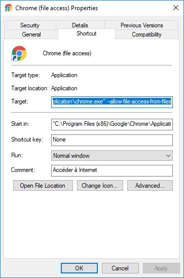
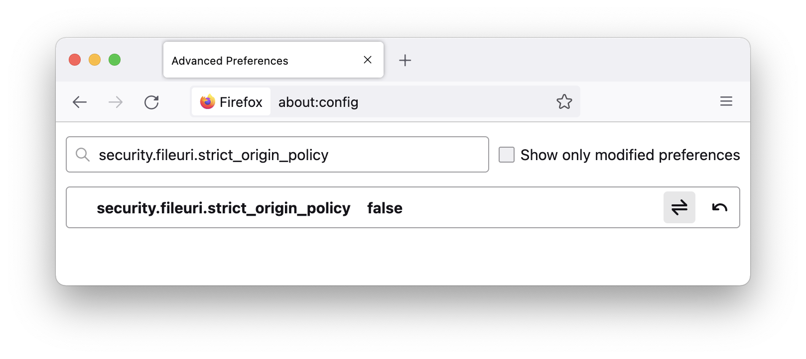

# How to enable local file access on your browser

## Chrome

⚠️ Important ⚠️
For these commands to work, all the Chrome windows should be closed beforehand.

### Linux:

```bash
chrome --allow-file-access-from-files index.html
```

### macOS:

```bash
open -a "Google Chrome" index.html --args --allow-file-access-from-files
```

### Windows:

1. Create a copy of the Chrome shortcut on your desktop and rename it
   to something like `Chrome (file access)`.
2. Right-click on the shortcut and choose `Properties`.
3. Edit the `Target` field by adding `--allow-file-access-from-files`
   after the double quotes (`"`).
4. Close all the Chrome windows and start Chrome through this new shortcut.
5. Now you can double-click the `index.html` file.




## Firefox
⚠️ Important ⚠️
For security reasons, you might want to revert this change after the end of
this class.

1. Type "about:config" in the search bar
2. If necessary, click on "Accept the Risk and Continue"
3. Search for "security.fileuri.strict_origin_policy"
4. Double click on `true` to set this parameter to `false`




## Safari
⚠️ Important ⚠️
For security reasons, you might want to revert this change after the end of
this class.

1. Enable the hidden Develop menu through system preferences [see here](http://www.idownloadblog.com/2016/07/01/how-to-enable-the-hidden-develop-menu-in-safari-on-mac/)
2. Click on "Develop --> Disable Local File Restrictions":


